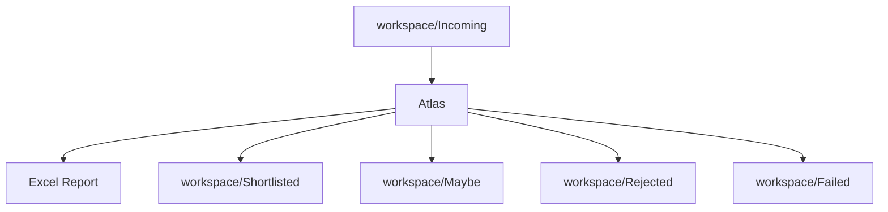
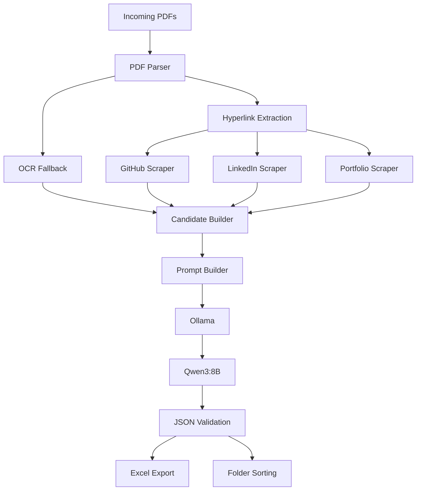
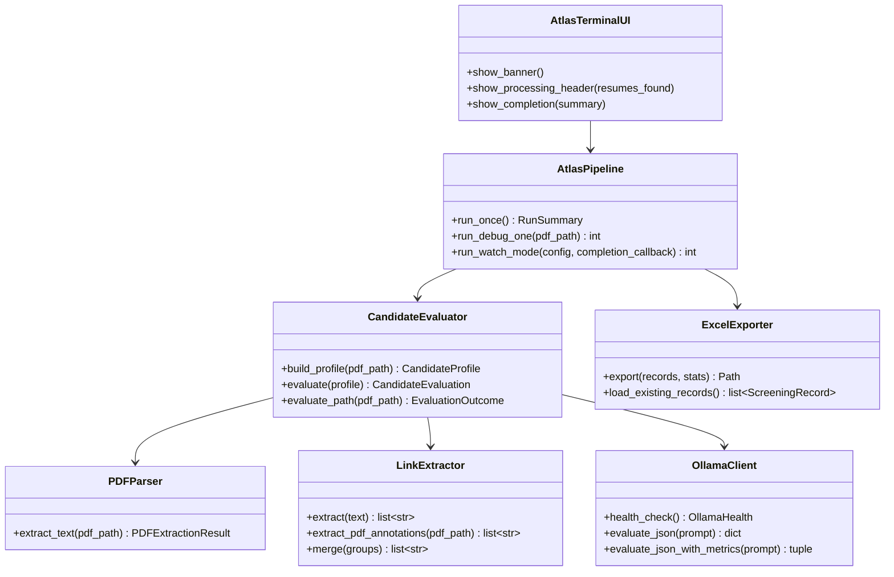
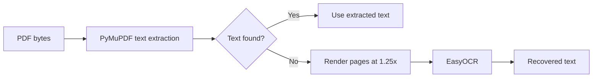

# Atlas

Atlas is an offline AI resume screening system that parses PDFs, extracts public profile links, scrapes public GitHub, LinkedIn, and portfolio pages when available, builds a structured candidate profile, asks a local Ollama model powered by Qwen3:8B for a JSON evaluation, and writes recruiter-ready Excel reports while sorting resumes into decision folders.

> [!NOTE]
> Atlas is designed to run locally on a Windows workstation. The default workspace root is hardcoded to `c:\this is dekstop\atlas` in the current build.

---

## Hero Banner

```text
     _    _______    __    _      ___   ____
    / \  |__   __|  / /   | |    / _ \ / ___|
   / _ \    | |    / /    | |   | | | | |  _
  / ___ \   | |   / /___  | |___| |_| | |_| |
 /_/   \_\  |_|  /_____/  |______\___/ \____|

Offline AI Resume Screening powered by local LLMs.
```

Atlas is built for private, local resume triage with no cloud dependency for inference.

## Installation and Run

Atlas is a local Python application. The current repository already includes the commands that are known to work in this workspace.

### 1) Create a virtual environment

```bash
python -m venv .venv
```

### 2) Activate the environment

```powershell
.venv\Scripts\activate
```

On PowerShell, the current workspace has also been activated successfully with:

```powershell
Set-ExecutionPolicy -Scope Process -ExecutionPolicy RemoteSigned
.venv\Scripts\Activate.ps1
```

### 3) Install dependencies

```bash
pip install -r requirements.txt
```

### 4) Make sure Ollama is running locally

Atlas expects Ollama to be reachable at `http://127.0.0.1:11434` and the `qwen3:8b` model to be available.

### 5) Run Atlas once

```bash
python main.py
```

### 6) Run Atlas in watch mode

```bash
python main.py --watch
```

### 7) Run the debug path for one PDF

```bash
python main.py --debug-one path\to\resume.pdf
```

### 8) Run tests

```bash
python -m unittest discover -s tests -v
```

> [!TIP]
> If you are using PowerShell, the activation script may need the `.ps1` path shown above. The repository also documents the generic shell activation form in `startCmds.md`.

---

## Badges


---

## Table of Contents

- [Why Atlas?](#why-atlas)
- [Features](#features)
- [Demo Workflow](#demo-workflow)
- [Screenshots](#screenshots)
- [System Requirements](#system-requirements)
- [Technology Stack](#technology-stack)
- [Project Structure](#project-structure)
- [Architecture Overview](#architecture-overview)
- [Sequence Diagram](#sequence-diagram)
- [Component Diagram](#component-diagram)
- [Pipeline](#pipeline)
- [Configuration](#configuration)
- [Prompt Engineering](#prompt-engineering)
- [OCR Pipeline](#ocr-pipeline)
- [Hyperlink Detection](#hyperlink-detection)
- [Public Profile Analysis](#public-profile-analysis)
- [Candidate Evaluation](#candidate-evaluation)
- [Excel Report](#excel-report)
- [Logging](#logging)
- [CLI Showcase](#cli-showcase)
- [Performance](#performance)
- [Security](#security)
- [Testing](#testing)
- [Troubleshooting](#troubleshooting)
- [FAQ](#faq)
- [Roadmap](#roadmap)
- [Contributing](#contributing)
- [License](#license)
- [Acknowledgements](#acknowledgements)
- [Final Notes](#final-notes)

---

## Why Atlas?

Recruiters and screening teams often need to sort many resumes quickly without sending private data to a cloud service. Atlas was built to solve that problem locally.

Atlas helps when you need to:

- Screen PDF resumes offline.
- Recover text from image-based PDFs with OCR fallback.
- Discover public profile links embedded in the document or annotated inside the PDF.
- Pull lightweight public context from GitHub, LinkedIn, and portfolio pages.
- Produce a normalized JSON evaluation from a local LLM.
- Export a recruiter-facing spreadsheet and sort files into decision buckets.
- Keep a persistent audit trail through logs, checkpoint files, and debug artifacts.

Target users include recruiters, university placement teams, and operators who want a private, local resume triage pipeline instead of a hosted ATS.

> [!IMPORTANT]
> Atlas is not a cloud ATS and it does not use authentication to inspect private accounts. It only works with the files in `workspace/Incoming` and public pages discovered from those files.

---

## Features

Atlas currently implements the following behaviors:

- [x] Offline AI resume screening.
- [x] PDF text extraction with PyMuPDF.
- [x] OCR fallback for image-based PDFs.
- [x] Visible URL extraction from resume text.
- [x] PDF hyperlink annotation extraction.
- [x] URL deduplication and normalization.
- [x] GitHub analysis through public page scraping.
- [x] LinkedIn analysis through public page scraping.
- [x] Portfolio analysis through public page scraping.
- [x] Candidate profile building.
- [x] Local LLM evaluation through Ollama.
- [x] Strict JSON validation with Pydantic.
- [x] Recruiter workbook export with OpenPyXL.
- [x] Resume classification into Shortlisted, Maybe, and Rejected.
- [x] Folder sorting into decision buckets.
- [x] Checkpoint recovery.
- [x] Watch mode.
- [x] Timing metrics.
- [x] Production logging.
- [x] Error recovery for parser, scraper, JSON, and file-move failures.
- [x] Retry logic for network fetches, OCR, and Ollama evaluation.
- [x] Rich CLI panels.
- [x] Progress bars.
- [x] ASCII status banners.
- [x] Debug artifact capture via `--debug-one`.

What Atlas does not currently do:

- It does not call a cloud LLM.
- It does not use private LinkedIn or GitHub APIs.
- It does not require Docker.
- It does not ship a web UI.
- It does not use `pytest` in the current validation flow.

---

## Demo Workflow



Typical flow:

1. Drop one or more PDF resumes into `workspace/Incoming`.
2. Run Atlas once or keep it in watch mode.
3. Atlas extracts resume text, scans annotations, and discovers public URLs.
4. Atlas scrapes public GitHub, LinkedIn, and portfolio pages when available.
5. Atlas builds a compact profile and sends it to the local Qwen3:8B model through Ollama.
6. Atlas validates the returned JSON and computes the final decision bucket.
7. Atlas writes `workspace/Reports/Candidates.xlsx`.
8. Atlas moves the PDF into `workspace/Shortlisted`, `workspace/Maybe`, `workspace/Rejected`, or `workspace/Failed`.

---

## Screenshots

The repository does not currently contain image assets, so the following are placeholders for future documentation captures.

- Startup banner placeholder.
- Processing header placeholder.
- Watch mode placeholder.
- Resume result card placeholder.
- Excel workbook placeholder.
- Completion summary placeholder.

> [!TIP]
> If you add screenshots later, place them under a docs asset folder and link them here with relative paths.

---

## System Requirements

| Item | Minimum | Recommended | Notes |
|---|---:|---:|---|
| Operating system | Windows | Windows 10/11 | The current default workspace path is Windows-specific. |
| Python | 3.10+ | 3.11+ or newer | The codebase uses modern typing syntax. |
| CPU | 4 cores | 8+ cores | OCR and local inference are CPU-heavy. |
| RAM | 8 GB | 16 GB+ | EasyOCR and a local 8B model are memory-intensive. |
| Storage | 2 GB free | 10 GB+ free | Keep room for logs, reports, OCR caches, and model files. |
| Ollama | Recent version | Recent version | Must expose `/api/tags` and `/api/chat`. |
| Model | `qwen3:8b` | `qwen3:8b` | This is the model configured in `config.py`. |

Expected behavior:

- Text-based resumes are usually faster because they do not need OCR.
- Image-based PDFs are slower because OCR is the fallback.
- Large batches scale roughly linearly because the model evaluation is sequential.

> [!NOTE]
> Atlas is a local-first pipeline. The main runtime bottlenecks are OCR and local LLM inference, not network I/O.

---

## Technology Stack

| Category | Technology | Purpose |
|---|---|---|
| Runtime | Python | Main application language. |
| LLM server | Ollama | Local HTTP API for model inference and health checks. |
| Model | Qwen3:8B | Local evaluator used for candidate scoring. |
| PDF parsing | PyMuPDF (`fitz`) | Extracts text from PDFs and reads hyperlink annotations. |
| OCR | EasyOCR | Recovers text from image-based PDFs. |
| OCR support | NumPy | Converts rendered PDF pixmaps into arrays for OCR. |
| OCR backend | PyTorch | Runtime backend used by EasyOCR. |
| HTTP client | Requests | Fetches public HTML pages and calls Ollama. |
| HTML parsing | BeautifulSoup4 | Extracts title, description, and text from fetched pages. |
| Workbook export | OpenPyXL | Generates the recruiter Excel workbook. |
| File watching | Watchdog | Detects new PDFs in `workspace/Incoming`. |
| Terminal UI | Rich | Renders banners, panels, rules, tables, and progress bars. |
| Banner art | PyFiglet | Generates the ASCII title banners. |
| Terminal color support | Colorama | Ensures Windows console rendering works cleanly. |
| Schema validation | Pydantic | Validates candidate, profile, and summary models. |
| JSON serialization | orjson | Handles strict model payloads and Ollama logs. |
| Standard library | `re`, `json`, `logging`, `pathlib`, `threading`, `queue`, `dataclasses`, `time`, `statistics`, `tempfile`, `unittest` | Core orchestration, parsing, logging, timing, and tests. |
| Manifest note | `tqdm` | Currently pinned in `requirements.txt` but not imported by the runtime code. |

---

## Project Structure

Actual repository structure:

```text
.
├── agents/
│   └── evaluator.py
├── core/
│   ├── pipeline.py
│   └── queue.py
├── docs/
├── exporters/
│   └── excel.py
├── llm/
│   ├── ollama.py
│   └── prompts.py
├── logs/
│   ├── atlas.log
│   └── ollama/
├── models/
│   └── candidate.py
├── parsers/
│   ├── link_extractor.py
│   ├── ocr.py
│   └── pdf_parser.py
├── scrapers/
│   ├── common.py
│   ├── github.py
│   ├── linkedin.py
│   └── portfolio.py
├── tests/
│   ├── test_excel.py
│   ├── test_imports.py
│   ├── test_logging.py
│   ├── test_models.py
│   ├── test_ollama.py
│   ├── test_parsers.py
│   ├── test_pipeline.py
│   ├── test_pipeline_resilience.py
│   └── test_scraper_resilience.py
├── ui/
│   └── terminal.py
├── utils/
│   └── logger.py
├── workspace/
│   ├── Debug/
│   ├── Failed/
│   ├── Incoming/
│   ├── Maybe/
│   ├── Processing/
│   ├── Rejected/
│   ├── Reports/
│   └── Shortlisted/
├── config.py
├── implementation.md
├── main.py
├── prompts.md
├── report.md
├── requirements.txt
├── startCmds.md
└── testingReports.md
```

### What each folder does

- `agents/` contains the candidate evaluation orchestration.
- `core/` contains the main pipeline and watch-mode queue wrapper.
- `docs/` is present as a documentation/output folder and is currently empty in the repository.
- `exporters/` contains the Excel writer.
- `llm/` contains the Ollama client and prompt template.
- `logs/` stores runtime logs and Ollama request/response artifacts.
- `models/` contains the Pydantic data models.
- `parsers/` contains PDF extraction, OCR, and link extraction.
- `scrapers/` contains the public-page scrapers and shared network helpers.
- `tests/` contains the unittest suite.
- `ui/` contains the Rich terminal presentation layer.
- `utils/` contains logging helpers.
- `workspace/` contains runtime inputs and outputs.

### What each top-level file does

- `config.py` defines runtime defaults, paths, and thresholds.
- `main.py` is the CLI entry point.
- `implementation.md` records implementation notes and module responsibilities.
- `prompts.md` documents the prompt and threshold locations.
- `report.md` records the stabilization report.
- `requirements.txt` lists the project dependencies.
- `startCmds.md` documents the standard commands.
- `testingReports.md` records validation history.

---

## Architecture Overview

Atlas is a single-machine pipeline with clear module boundaries:

- `main.py` handles CLI parsing and terminal presentation.
- `ui/terminal.py` renders banners, progress bars, warning panels, and completion summaries.
- `core/pipeline.py` owns the orchestration, file movement, checkpointing, and watch mode.
- `agents/evaluator.py` builds the candidate profile and produces the evaluation request.
- `parsers/pdf_parser.py` and `parsers/link_extractor.py` extract resume content and URLs.
- `scrapers/*.py` enrich public profile links with compact summaries.
- `llm/ollama.py` talks to the local Ollama HTTP API.
- `exporters/excel.py` writes the workbook.
- `models/candidate.py` keeps the data contracts strict.
- `utils/logger.py` routes console and file logs.



---

## Sequence Diagram

```mermaid
sequenceDiagram
    actor Recruiter
    participant Atlas as Atlas CLI
    participant UI as Rich Terminal UI
    participant Parser as PDF Parser
    participant OCR as EasyOCR
    participant Links as Link Extractor
    participant GH as GitHub Scraper
    participant LI as LinkedIn Scraper
    participant Port as Portfolio Scraper
    participant Builder as Candidate Builder
    participant Prompt as Prompt Builder
    participant Ollama as Ollama
    participant Qwen as Qwen3:8B
    participant Validator as JSON Validator
    participant Excel as Excel Exporter
    participant Workspace as Workspace

    Recruiter->>Workspace: Drop PDF into workspace/Incoming
    Recruiter->>Atlas: Run python main.py or python main.py --watch
    Atlas->>UI: Render banner and processing header
    Atlas->>Parser: Extract visible text from PDF
    alt PDF text is empty or image-only
        Parser->>OCR: Render pages and extract OCR text
        OCR-->>Parser: OCR text + timing
    end
    Parser-->>Atlas: Text + OCR metadata
    Atlas->>Links: Extract visible URLs and PDF annotations
    Links-->>Atlas: Deduped HTTP(S) URLs
    Atlas->>GH: Scrape GitHub summary when a GitHub URL exists
    Atlas->>LI: Scrape LinkedIn summary when a LinkedIn URL exists
    Atlas->>Port: Scrape portfolio summary when a portfolio URL exists
    GH-->>Atlas: Public page summary or unavailable result
    LI-->>Atlas: Public page summary or unavailable result
    Port-->>Atlas: Public page summary or unavailable result
    Atlas->>Builder: Build CandidateProfile
    Builder->>Prompt: Build JSON-only prompt payload
    Prompt->>Ollama: Send evaluation prompt
    Ollama->>Qwen: Request local model output
    Qwen-->>Ollama: Streaming JSON response
    Ollama-->>Atlas: Parsed JSON + timings
    Atlas->>Validator: Validate response against CandidateEvaluation
    Validator-->>Atlas: Validated candidate scores
    Atlas->>Excel: Export workbook sheets and summary
    Atlas->>Workspace: Move PDF to Shortlisted/Maybe/Rejected/Failed
    Atlas-->>UI: Render result panel and completion summary
```

---

## Component Diagram



---

## Pipeline

Atlas processes one resume at a time through a predictable set of stages.

### 1. Incoming folder

`workspace/Incoming` is the input queue. Atlas looks for `*.pdf` files there.

### 2. PDF parsing

`parsers/pdf_parser.py` uses PyMuPDF to extract text from each PDF. It returns a `PDFExtractionResult` object that carries:

- `text`
- `pdf_time`
- `ocr_time`
- `ocr_used`
- `ocr_reason`

### 3. OCR fallback

If the PDF text layer is empty, Atlas renders pages at `1.25x` and uses EasyOCR to recover text from image-based PDFs.

### 4. Hyperlink extraction

`parsers/link_extractor.py`:

- Extracts visible `http://` and `https://` URLs from text.
- Extracts hyperlink annotations directly from the PDF.
- Normalizes and deduplicates the URLs.

### 5. Public scraping

`agents/evaluator.py` classifies URLs and dispatches them to:

- `GitHubScraper`
- `LinkedInScraper`
- `PortfolioScraper`

These scrapers fetch public HTML and reduce it to compact summaries.

### 6. Candidate building

The evaluator assembles a `CandidateProfile` with:

- resume identity fields
- deterministic resume signals
- link collections
- source summaries
- OCR and scrape timing metadata

### 7. Prompt engineering

Atlas converts the profile into a JSON-only prompt and trims the payload to stay under prompt limits.

### 8. LLM evaluation

`llm/ollama.py` sends the prompt to Ollama and streams the model response from the local `qwen3:8b` model.

### 9. JSON validation

The raw response is validated against `CandidateEvaluation`. Invalid or empty responses are retried, then routed to failure if they still cannot be validated.

### 10. Excel export

`exporters/excel.py` writes the workbook and summary sheet.

### 11. Folder sorting

The PDF is moved into one of the decision folders.

### 12. Completion

`main.py` can render a completion summary after one-shot runs and after watch-mode queue drain.

---

## Configuration

`config.py` is the authoritative source for Atlas runtime settings.

### Path model

`AtlasPaths` derives every workspace path from `root` when fields are left at their defaults. That means a custom root automatically points `workspace/`, `logs/`, and `docs/` underneath the new location.

### Path fields

| Field | Default value | Purpose |
|---|---|---|
| `root` | `c:\this is dekstop\atlas` | Base workspace root. |
| `workspace` | `root\workspace` | Root for runtime inputs and outputs. |
| `incoming` | `workspace\Incoming` | Input PDFs. |
| `processing` | `workspace\Processing` | Reserved staging folder created by `ensure_directories()`. |
| `shortlisted` | `workspace\Shortlisted` | Destination for shortlisted resumes. |
| `maybe` | `workspace\Maybe` | Destination for maybe resumes. |
| `rejected` | `workspace\Rejected` | Destination for rejected resumes. |
| `failed` | `workspace\Failed` | Destination for fatal failures. |
| `reports` | `workspace\Reports` | Workbook and checkpoint output directory. |
| `workbook` | `workspace\Reports\Candidates.xlsx` | Main Excel report. |
| `debug` | `workspace\Debug` | Debug artifacts for `--debug-one`. |
| `checkpoint` | `workspace\Reports\atlas_checkpoint.json` | Recovery state for completed resumes. |
| `logs` | `root\logs` | Application and Ollama logs. |
| `docs` | `root\docs` | Documentation/output folder currently empty in the repo. |

### Runtime constants

| Constant | Default | Purpose |
|---|---:|---|
| `OLLAMA_BASE_URL` | `http://127.0.0.1:11434` | Local Ollama endpoint. |
| `OLLAMA_MODEL` | `qwen3:8b` | Model name used for resume evaluation. |
| `SHORTLIST_THRESHOLD` | `60` | Score cutoff for `Shortlisted`. |
| `MAYBE_THRESHOLD` | `50` | Score cutoff for `Maybe`. |
| `PREPROCESS_WORKERS` | `6` | Stored configuration knob for preprocessing parallelism. The current runtime path remains effectively sequential. |
| `OLLAMA_TIMEOUT_SECONDS` | `60` | Ollama request timeout. |
| `OLLAMA_MAX_RETRIES` | `1` | Retry count for Ollama evaluation. |
| `OLLAMA_RETRY_DELAYS` | `(0, 1)` | Retry backoff for Ollama evaluation. |
| `OLLAMA_TEMPERATURE` | `0.0` | Deterministic generation setting. |
| `OLLAMA_TOP_P` | `0.9` | Sampling parameter forwarded to Ollama. |
| `OLLAMA_TOP_K` | `40` | Sampling parameter forwarded to Ollama. |
| `OLLAMA_NUM_CTX` | `8192` | Context window sent to Ollama. |
| `OLLAMA_NUM_PREDICT` | `256` | Output token cap sent to Ollama. |
| `OLLAMA_THINK` | `False` | Disables model thinking mode in the current build. |
| `REQUEST_TIMEOUT_SECONDS` | `20` | Timeout for public HTTP fetches. |
| `OCR_TIMEOUT_SECONDS` | `60` | OCR timeout budget. |
| `OCR_MAX_RETRIES` | `1` | OCR retry count. |
| `OCR_RETRY_DELAYS` | `(0, 1)` | OCR retry backoff. |
| `MAX_RESUME_EXCERPT_CHARS` | `2500` | Maximum text excerpt from the PDF body. |
| `MAX_SCRAPED_TEXT_CHARS` | `2500` | Maximum text kept from scraped pages. |
| `MAX_LINKS_PER_RESUME` | `5` | Upper bound on retained links per resume. |
| `MAX_PROMPT_CHARS` | `5000` | Upper bound on the built prompt size. |
| `MAX_PROMPT_ESTIMATED_TOKENS` | `1300` | Soft token budget used by prompt logging. |
| `MAX_SOURCE_SUMMARY_CHARS` | `1500` | Maximum per-source summary length. |
| `MAX_DEBUG_ARTIFACT_CHARS` | `20000` | Upper bound for debug artifact text capture. |
| `NETWORK_FAILURE_THRESHOLD` | `5` | Consecutive network failures before temporary disablement. |
| `NETWORK_RECOVERY_SECONDS` | `300` | Cooldown time before network scraping is re-enabled. |
| `PROGRESS_REFRESH_SECONDS` | `1.0` | Progress refresh interval. |
| `DNS_RESOLVERS` | `("1.1.1.1", "8.8.8.8")` | DNS fallback resolvers used by the scraper helper. |

### Config behaviors

- `ensure_directories()` creates the workspace, output, logs, and docs folders Atlas expects.
- `decision_for_score()` maps a numeric score to `Shortlisted`, `Maybe`, or `Rejected`.

> [!NOTE]
> The current codebase stores `preprocess_workers`, but the main pipeline path does not yet fan out into a general-purpose preprocessing pool. The value remains part of the config surface because it is still used by tests and future expansion.

---

## Prompt Engineering

Atlas keeps all model-facing instructions in `llm/prompts.py`.

The current prompt contract is:

- JSON-only.
- No markdown.
- No commentary.
- No code fences.
- Exact keys only.

The evaluator in `agents/evaluator.py` constructs the final prompt by combining:

- the resume file name,
- the resume name and contact fields,
- the deterministic excerpt,
- extracted skills,
- extracted projects,
- achievements,
- leadership and communication signals,
- GitHub signals,
- compact summaries from public sources,
- and the OCR state.

Atlas trims the prompt repeatedly until it fits under `MAX_PROMPT_CHARS`. That keeps local inference stable and reduces the risk of truncated JSON.

> [!IMPORTANT]
> Atlas does not expose proprietary prompt text beyond the repository’s own prompt file. The evaluation prompt is intentionally short and deterministic.

---

## OCR Pipeline



Implementation details:

- `PDFParser.extract_text()` uses PyMuPDF first.
- If the PDF text layer is empty, EasyOCR is invoked page by page.
- The OCR result is wrapped in `PDFExtractionResult` with timing and reason metadata.
- OCR failures raise `PDFParseError` when the resume cannot be recovered.
- The OCR engine is cached lazily through `get_ocr_engine()`.

---

## Hyperlink Detection

Atlas uses two URL discovery channels:

1. Visible text URLs.
2. PDF hyperlink annotations.

`LinkExtractor` does the following:

- matches `http://` and `https://` URLs with a regular expression,
- extracts annotation URIs from PDF links,
- strips trailing punctuation,
- keeps only HTTP(S) URLs,
- deduplicates while preserving order.

The evaluator then classifies the merged URLs into:

- GitHub,
- LinkedIn,
- portfolio,
- and other URLs.

The detected links are also retained in `SocialLinks.all_urls`.

---

## Public Profile Analysis

Atlas does not call private APIs. It fetches public HTML pages and reduces them to short summaries for the model prompt.

### GitHub analysis

`GitHubScraper`:

- accepts GitHub URLs,
- fetches the public page,
- extracts title, description, and page text,
- compresses the result to a short summary.

Atlas treats GitHub as a public signal source, not a repository crawler.

### LinkedIn analysis

`LinkedInScraper` works the same way, but only for public LinkedIn pages discovered in resumes.

### Portfolio analysis

`PortfolioScraper` handles non-social public websites and produces compact summaries.

### Shared scraping behavior

`scrapers/common.py` provides:

- a lightweight connectivity check,
- retry-aware HTML fetching,
- DNS fallback resolvers,
- temporary network disablement after repeated failures,
- public-page summary reduction.

> [!WARNING]
> If a public page is unavailable, Atlas logs a warning and continues. Unavailable sources are expected and do not terminate the pipeline.

---

## Candidate Evaluation

Atlas uses a mixed deterministic + LLM evaluation pipeline.

### Deterministic signals

The evaluator extracts:

- email,
- phone,
- college,
- degree,
- skills keywords,
- project lines,
- achievements keywords,
- leadership keywords,
- communication keywords,
- GitHub signals.

### LLM-generated scores

The model returns the core scoring payload, including:

- `overall_score`
- `technical_score`
- `github_score`
- `projects_score`
- `leadership_score`
- `communication_score`
- `achievements_score`
- `recommendation`
- `summary`
- `strengths`
- `weaknesses`

### Deterministic enrichment

If the model leaves some fields empty, Atlas derives them locally:

- `skills_score = technical_score * 0.6 + len(skills) * 5 + len(github_signals) * 3`
- `experience_score = projects_score * 0.4 + leadership_score * 0.3 + achievements_score * 0.3`
- `resume_quality_score = communication_score * 0.4 + technical_score * 0.4 + completeness * 4`

Where `completeness` is the count of present identity fields among name, email, phone, college, and degree.

### Decision mapping

`AtlasConfig.decision_for_score()` maps the final score to:

- `Shortlisted` when `score >= 60`
- `Maybe` when `50 <= score < 60`
- `Rejected` when `score < 50`

> [!NOTE]
> The model response is validated with `CandidateEvaluation.model_validate(...)`, which forbids extra fields and enforces score bounds.

---

## Excel Report

Atlas writes `workspace/Reports/Candidates.xlsx` with OpenPyXL.

### Worksheets

| Sheet | Purpose |
|---|---|
| `ALL CANDIDATES` | Sorted full candidate list. |
| `SHORTLISTED` | Only shortlisted candidates. |
| `MAYBE` | Only maybe candidates. |
| `REJECTED` | Only rejected candidates. |
| `SUMMARY` | Aggregate run statistics. |

### Columns in the main sheets

| Column | Meaning |
|---|---|
| Rank | Sort order by score. |
| Candidate Name | Final candidate name. |
| Email | Candidate email. |
| Phone | Candidate phone number. |
| Degree | Highest degree detected. |
| Overall Score | Final model score. |
| GitHub Score | Model score for GitHub. |
| Skills Score | Derived/filled score for skills. |
| Projects Score | Model score for projects. |
| Experience Score | Derived/filled score for experience. |
| Achievements Score | Model score for achievements. |
| Leadership Score | Model score for leadership. |
| Communication Score | Model score for communication. |
| Resume Quality Score | Derived/filled resume quality score. |
| Recommendation | Raw recommendation returned by the model. |
| Decision | Final folder decision. |
| Summary | Short natural-language summary. |
| Resume Filename | Source PDF file name. |

### Summary sheet metrics

`SUMMARY` includes:

- processed count,
- shortlisted count,
- maybe count,
- rejected count,
- failed count,
- highest score,
- lowest score,
- average score,
- average processing time,
- average OCR time,
- average scrape time,
- average LLM time,
- average Excel time,
- total runtime,
- timestamp.

### Workbook behavior

- Atlas reloads existing rows when resuming from a previous workbook.
- Workbook export is attempted again on each run.
- Existing data is preserved and re-sorted by score.

---

## Logging

`utils/logger.py` configures Atlas logging.

### Console logging

- Console output is concise.
- Tracebacks are suppressed in the terminal handler.
- Rich UI handlers can intercept log records and render them as panels.

### File logging

- Logs are written to `logs/atlas.log`.
- Ollama request/response/timing artifacts are written under `logs/ollama/`.

### What gets logged

- startup events,
- prompt statistics,
- scraping warnings,
- retry attempts,
- processing summaries,
- dashboard lines,
- file-move warnings,
- watch-mode lifecycle events.

### Current hardening behavior

- Missing source files during file move are downgraded to warnings.
- Duplicate watch events are ignored.
- Temporary lock errors are retried.
- Recoverable failures do not terminate Atlas.

---

## CLI Showcase

Atlas uses `Rich` and `PyFiglet` for terminal presentation.

### Startup banner

> Screenshot placeholder: Atlas startup banner.

### Processing banner

> Screenshot placeholder: processing header with workspace, model, OCR engine, watch mode, and resume count.

### Resume result cards

> Screenshot placeholder: shortlist / maybe / rejected result panel.

### Completion banner

> Screenshot placeholder: completion banner and processing summary panel.

### Watch mode

> Screenshot placeholder: live watch mode with progress bar and queue updates.

The UI currently renders:

- a large ASCII title,
- a processing header panel,
- a progress bar with elapsed/remaining time,
- per-resume result cards,
- warning panels for unavailable sources,
- a completion summary.

---

## Performance

Atlas does not ship a formal benchmark harness, so the best reference is the observed current behavior in this workspace.

### Observed runtime characteristics

- OCR-heavy resumes are the slowest case.
- Local Ollama inference is the second major cost.
- Public scraping is usually short but can add latency when pages are unavailable or slow.
- Workbook export is comparatively fast.
- File movement is now treated as a best-effort finalization step.

### Practical expectations

| Scenario | Expected behavior |
|---|---|
| Clean text PDF | Faster, because OCR is skipped. |
| Scanned/image PDF | Slower, because OCR must recover text. |
| Resumes with public links | Slightly slower because of public HTML fetches. |
| Offline workstation | Faster in the sense that Atlas skips external scraping entirely. |
| Watch mode | Best for small, continuous intake. |

### Current validation note

A live end-to-end validation run in the workspace processed one resume in roughly 151 seconds on the current machine, with most of the time spent in OCR and local model inference.

> [!TIP]
> If you need higher throughput, the biggest gains will come from reducing OCR usage, using a smaller model, or lowering prompt size.

---

## Security

Atlas is intentionally privacy-first.

- Resume evaluation happens locally.
- Ollama is contacted over localhost.
- No cloud inference is used.
- Public profile scraping only uses public HTML pages.
- Resume files stay in the local workspace.
- Logs and checkpoints stay inside the repository root.

### Data handling notes

- `workspace/Incoming` is the intake folder.
- `workspace/Reports` stores the workbook and checkpoint.
- `workspace/Debug` is only used by `--debug-one`.
- `logs/ollama/` contains the request and response traces for local debugging.

---

## Testing

Atlas is validated with the standard library test runner.

### Commands

```bash
python -m unittest discover -s tests -v
```

For the current workspace, this is the command that is known to work because `pytest` is not installed by default.

### What the tests cover

- module import verification,
- PDF parsing,
- link extraction,
- model validation,
- Ollama client behavior,
- Excel export,
- logging,
- pipeline success path,
- pipeline resilience paths,
- scraper resilience paths.

### Representative tests

- `tests/test_imports.py`
- `tests/test_parsers.py`
- `tests/test_ollama.py`
- `tests/test_excel.py`
- `tests/test_logging.py`
- `tests/test_pipeline.py`
- `tests/test_pipeline_resilience.py`
- `tests/test_scraper_resilience.py`

### Validation notes

- The test suite currently uses `unittest`, not `pytest`.
- OCR dependencies are real in the runtime environment.
- The pipeline tests mock Ollama evaluation where appropriate.

> [!IMPORTANT]
> The codebase currently validates the runtime behavior through unittest-based checks and live CLI runs rather than a dedicated pytest suite.

---

## Troubleshooting

| Symptom | Likely cause | Fix |
|---|---|---|
| Ollama is not reachable | The local Ollama service is not running | Start Ollama and confirm `/api/tags` responds. |
| Model not available | `qwen3:8b` is not pulled in Ollama | Pull or install the configured model. |
| OCR fails on scanned PDF | EasyOCR cannot initialize or the PDF is unreadable | Confirm OCR dependencies are installed and the PDF is valid. |
| GitHub unavailable | Public page unavailable, blocked, or missing | Atlas logs a warning and continues. |
| LinkedIn unavailable | Public page unavailable or blocked | Atlas logs a warning and continues. |
| Portfolio unavailable | Public page unavailable or invalid | Atlas logs a warning and continues. |
| Excel missing | Workbook not yet exported or file permission issue | Re-run Atlas after clearing locks. |
| Permission denied during file move | Windows file lock or antivirus hold | Atlas now retries and skips non-fatal move failures. |
| Watch mode not detecting files | File was not placed in `workspace/Incoming` or event was duplicated | Confirm the file is a PDF and that it is new. |
| Processing too slow | OCR or Ollama is the bottleneck | Use smaller batches or text-based PDFs. |
| JSON invalid | Model returned non-conforming output | Atlas retries, then routes the resume as a failure if validation still fails. |
| LLM timeout | Ollama took longer than `OLLAMA_TIMEOUT_SECONDS` | Increase timeout or use a smaller model. |
| Checkpoint recovery not working | Checkpoint file missing or incompatible | Inspect `workspace/Reports/atlas_checkpoint.json`. |
| File movement errors | Source file already moved or missing | Atlas now treats this as non-fatal. |
| Duplicate watcher events | Windows file system emitted multiple events | Atlas deduplicates by file signature. |
| `pytest` command fails | `pytest` is not installed in the current environment | Use the documented `unittest` command instead. |

### Additional recovery checks

If Atlas appears stuck:

1. Check `logs/atlas.log`.
2. Check `logs/ollama/` for request/response files.
3. Check `workspace/Reports/atlas_checkpoint.json`.
4. Check whether `workspace/Incoming` still contains the PDF.
5. Confirm Ollama is still running.

---

## FAQ

1. What is Atlas?
   - Atlas is an offline AI resume screening pipeline for PDF resumes.

2. Does Atlas run without the internet?
   - Yes. It skips public scraping when network connectivity is unavailable.

3. Does Atlas call a cloud LLM?
   - No. It uses local Ollama inference.

4. Which model does Atlas use?
   - `qwen3:8b`.

5. Where do I put resumes?
   - `workspace/Incoming`.

6. Where do shortlisted resumes go?
   - `workspace/Shortlisted`.

7. Where do maybe resumes go?
   - `workspace/Maybe`.

8. Where do rejected resumes go?
   - `workspace/Rejected`.

9. Where do fatal failures go?
   - `workspace/Failed`.

10. Where is the Excel report written?
    - `workspace/Reports/Candidates.xlsx`.

11. Does Atlas support watch mode?
    - Yes, via `python main.py --watch`.

12. Does Atlas support one-off runs?
    - Yes, via `python main.py`.

13. Is there a debug mode?
    - Yes, `python main.py --debug-one <path>`.

14. Does Atlas parse links from PDF annotations?
    - Yes.

15. Does Atlas deduplicate links?
    - Yes, visible links and annotation links are merged and deduplicated.

16. Does Atlas extract OCR text from scanned PDFs?
    - Yes, when no text layer is available.

17. Can Atlas run on Linux or macOS unchanged?
    - Not by default. The current default root is Windows-specific.

18. Does Atlas keep private data in the cloud?
    - No.

19. Why is `pytest` not used here?
    - The current test flow uses `unittest` and that is the validated path in this workspace.

20. What happens if a public profile page is unavailable?
    - Atlas logs a warning and continues.

21. What happens if a PDF is already moved before Atlas tries to move it?
    - Atlas logs a warning and skips the move.

22. What happens if watch mode sees the same file twice?
    - Atlas deduplicates it by file signature.

23. What if Ollama returns invalid JSON?
    - Atlas retries and then fails the resume if validation still does not pass.

24. What if the workbook is open in Excel?
    - The save can fail; close the workbook and re-run.

25. What if a resume contains no links?
    - Atlas still evaluates the resume using the text and deterministic signals.

26. What if a PDF contains only images?
    - Atlas falls back to OCR.

27. What if OCR is unavailable?
    - The PDF is treated as unreadable and routed as a failure.

28. What if the local model is slow?
    - Expect longer processing time; that is normal for local inference.

29. Is `workspace/Processing` actively used?
    - It is created by configuration and reserved as a staging directory in the current build.

30. Does Atlas write debug artifacts automatically?
    - Only when you use `--debug-one`.

---

## Roadmap

These are future improvement ideas, not current features.

### v1.1

- Add optional configuration overrides from a file.
- Improve run summaries with richer timing breakdowns.
- Add a small docs asset folder for screenshots.

### v1.2

- Expand the operator guide for watch-mode operations.
- Add optional batch-limited processing controls.
- Surface more workbook analytics in the summary sheet.

### v2.0

- Make the workspace root portable by default.
- Add CI validation for the unittest suite.
- Add a formal release checklist for report regeneration.

---

## Contributing

Atlas is currently a small, tightly scoped codebase. Keep changes focused and traceable.

### Style

- Prefer small, targeted changes.
- Preserve the existing module boundaries.
- Keep the terminal UI polished but minimal.
- Avoid introducing dependencies that do not belong in the local/offline pipeline.

### Testing

Before opening a PR:

```bash
python -m unittest discover -s tests -v
```

Also run the CLI on at least one PDF if your change touches the pipeline, OCR, link extraction, logging, or file movement.

### Branch naming

Recommended examples:

- `docs/readme-refresh`
- `fix/watch-mode-dedupe`
- `chore/dependency-update`

### Commit messages

Keep them short and descriptive:

- `docs: refresh README`
- `fix: harden file move handling`
- `test: add pipeline regression coverage`

### Pull requests

A good PR should include:

- a clear summary of the change,
- the motivation,
- the commands you ran,
- the validation evidence,
- and any user-facing behavior changes.

---

## License

MIT placeholder.

Add a real `LICENSE` file before publishing the repository publicly.

---

## Acknowledgements

Atlas depends on a strong open-source stack:

- Ollama
- Qwen
- PyMuPDF
- EasyOCR
- NumPy
- OpenPyXL
- BeautifulSoup4
- Requests
- Watchdog
- Rich
- PyFiglet
- Colorama
- Pydantic
- orjson

---

## Final Notes

Atlas is built around three principles:

1. Privacy first.
2. Offline first.
3. Production stability over flashy features.

The current codebase is optimized for a recruiter workflow where the operator wants local control, readable outputs, recoverable failures, and a repeatable pipeline rather than a black-box SaaS experience.

If you are extending Atlas, keep the existing contract intact:

- PDFs come in through `workspace/Incoming`.
- The pipeline extracts text, links, and public profile context.
- Ollama performs the final scoring.
- Excel remains the primary report artifact.
- Files end up in the appropriate decision folder.
- Failures should be logged, not catastrophic.
