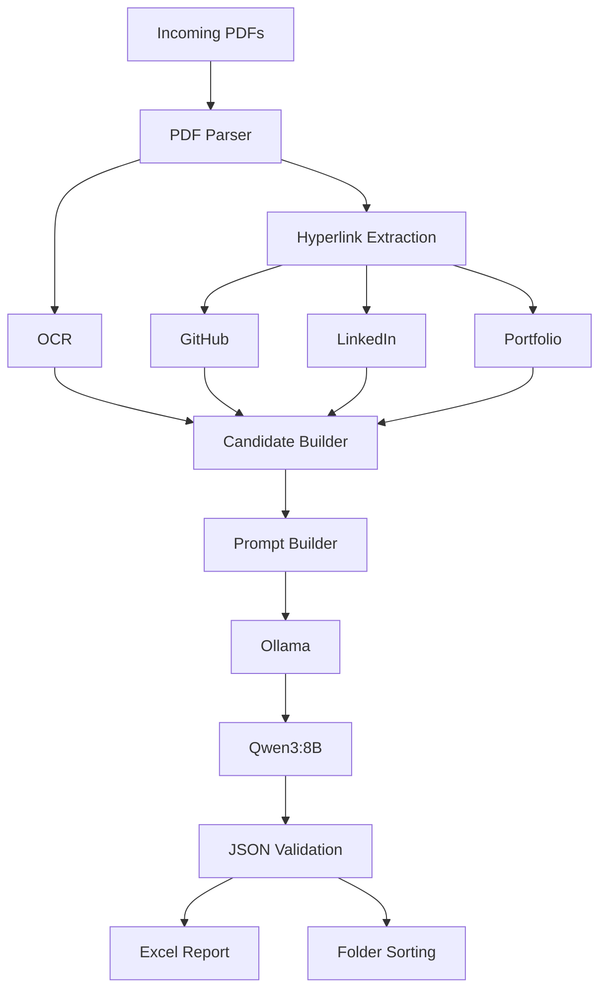
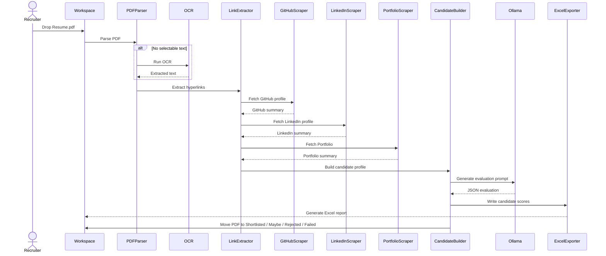

# QWENTUS

> **Offline AI Resume Screening System powered by Ollama + Qwen3:8B**

QWENTUS is a fully local AI-powered Resume Screening System that automatically parses resumes, extracts public profile links, analyzes candidate information using a locally hosted Large Language Model (Qwen3:8B via Ollama), generates recruiter-ready Excel reports, and sorts resumes into decision folders — all without sending resume data to the cloud.

---

## Features

- Offline AI Resume Screening
- Local LLM using Ollama + Qwen3:8B
- PDF Text Extraction (PyMuPDF)
- OCR Fallback for Scanned/Image PDFs
- Hyperlink Detection
  - Visible URLs
  - Embedded PDF Hyperlinks
- GitHub Analysis
- LinkedIn Analysis
- Portfolio Analysis
- Resume Evaluation
- Automatic Resume Sorting
- Recruiter Excel Report
- Watch Mode
- Rich CLI
- Retry Logic
- Graceful Failure Handling
- Timing Metrics
- Production Logging

---

# Demo Workflow

```text
Incoming Resume
       │
       ▼
 Parse PDF
       │
       ▼
OCR (If Needed)
       │
       ▼
Extract Hyperlinks
       │
       ▼
GitHub
LinkedIn
Portfolio
       │
       ▼
Candidate Profile
       │
       ▼
Prompt Builder
       │
       ▼
Ollama
(Qwen3:8B)
       │
       ▼
JSON Evaluation
       │
       ▼
Excel Report
       │
       ▼
Move Resume
```

---

# Screenshots

Add screenshots here.

Example:

- Startup Banner
- Resume Processing
- Excel Report
- Watch Mode
- Completion Summary

---

# Installation

## Clone Repository

```bash
git clone <repository-url>
cd QWENTUS
```

---

## Create Virtual Environment

```bash
python -m venv .venv
```

---

## Activate Environment

### Windows

```powershell
.venv\Scripts\activate
```

---

## Install Dependencies

```bash
pip install -r requirements.txt
```

---

## Install Ollama

Download Ollama

https://ollama.com/

---

## Pull Model

```bash
ollama pull qwen3:8b
```

---

## Verify Installation

```bash
ollama list
```

---

## Run

Single Run

```bash
python main.py
```

Watch Mode

```bash
python main.py --watch
```

Debug

```bash
python main.py --debug-one path/to/resume.pdf
```

Run Tests

```bash
python -m unittest discover -s tests -v
```

---

# Technology Stack

| Category | Technology |
|-----------|------------|
| Language | Python 3 |
| Local LLM | Ollama |
| Model | Qwen3:8B |
| PDF Parsing | PyMuPDF |
| OCR | EasyOCR |
| OCR Backend | PyTorch |
| HTTP | Requests |
| HTML Parsing | BeautifulSoup4 |
| Excel | OpenPyXL |
| File Watching | Watchdog |
| CLI | Rich |
| ASCII Banner | PyFiglet |
| Windows Colors | Colorama |
| Validation | Pydantic |
| JSON | orjson |
| Testing | unittest |

---

# Project Structure

```text
QWENTUS/

├── agents/
├── core/
├── exporters/
├── llm/
├── logs/
├── models/
├── parsers/
├── scrapers/
├── tests/
├── ui/
├── utils/

├── workspace/
│   ├── Incoming/
│   ├── Processing/
│   ├── Shortlisted/
│   ├── Maybe/
│   ├── Rejected/
│   ├── Failed/
│   └── Reports/

├── config.py
├── implementation.md
├── report.md
├── testingReports.md
├── main.py
└── requirements.txt
```

---

# System Architecture



---

## UML Sequence Diagram


---

# Processing Pipeline

```text
Incoming Resume
        │
        ▼
PDF Parsing
        │
        ▼
OCR (Optional)
        │
        ▼
Hyperlink Extraction
        │
        ▼
GitHub / LinkedIn / Portfolio
        │
        ▼
Candidate Builder
        │
        ▼
Prompt Builder
        │
        ▼
Ollama
        │
        ▼
Qwen3:8B
        │
        ▼
JSON Validation
        │
        ▼
Excel Generation
        │
        ▼
Resume Sorting
```

---

# Excel Report

QWENTUS generates a recruiter-friendly Excel workbook.

## Candidate Table

| Name | GitHub Score | Skills Score | Achievements Score | Projects Score | Experience Score | Overall Score | Decision |
|------|--------------|--------------|--------------------|----------------|------------------|---------------|----------|

---

## Sheets

- All Candidates
- Shortlisted
- Maybe
- Rejected
- Summary

---

# Configuration

Configuration is centralized in

```text
config.py
```

Examples:

- OCR Engine
- LLM Timeout
- Retry Count
- DNS Servers
- Folder Paths
- Threshold Scores

---

# CLI Commands

Run Once

```bash
python main.py
```

Watch Mode

```bash
python main.py --watch
```

Debug

```bash
python main.py --debug-one resume.pdf
```

Tests

```bash
python -m unittest discover -s tests -v
```

---

# Performance

Current Optimizations

- OCR only when required
- Embedded hyperlink extraction
- Prompt size optimization
- Retry logic
- Network health checks
- Graceful failure recovery
- Production logging
- Local inference
- Automatic Excel generation

---

# Troubleshooting

| Issue | Solution |
|--------|----------|
| Ollama not running | `ollama serve` |
| Model missing | `ollama pull qwen3:8b` |
| OCR not working | Verify EasyOCR installation |
| Excel locked | Close workbook and rerun |
| GitHub unavailable | Pipeline continues normally |
| LinkedIn unavailable | Pipeline continues normally |
| Portfolio unavailable | Pipeline continues normally |
| LLM timeout | Restart Ollama or reduce prompt size |

---

# Contributing

1. Fork the repository

2. Create a feature branch

```bash
git checkout -b feature/my-feature
```

3. Commit changes

```bash
git commit -m "feat: add new feature"
```

4. Push

```bash
git push origin feature/my-feature
```

5. Open a Pull Request

---

# License

MIT License

---

# Acknowledgements

Special thanks to the open-source community.

- Ollama
- Qwen Team
- PyMuPDF
- EasyOCR
- PyTorch
- BeautifulSoup4
- Requests
- OpenPyXL
- Watchdog
- Rich
- PyFiglet
- Pydantic
- orjson

---

**Made with ❤️ by [Aryan Gupta](https://github.com/Aryan27-max)**
