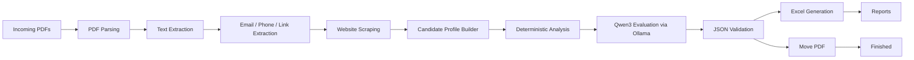
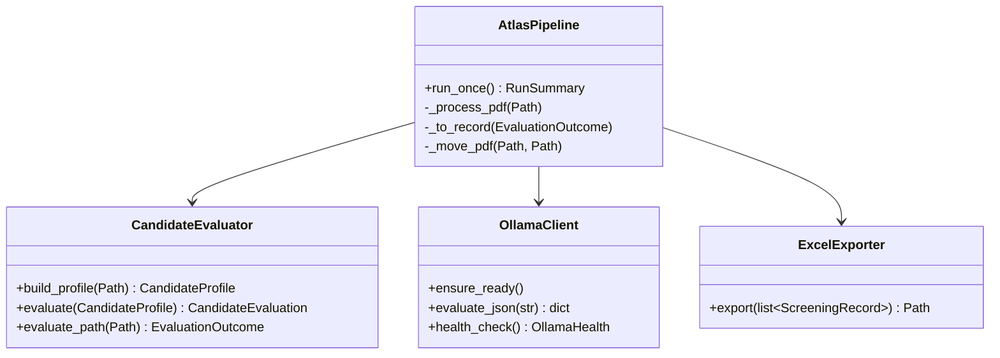

# Atlas Implementation

## Module Overview

`config.py` centralizes the hardcoded workspace path, threshold values, Ollama configuration, and filesystem locations.

`main.py` is the command-line entry point. It creates the logger, verifies the environment, and launches the pipeline.

`parsers/pdf_parser.py` extracts text from PDF files with PyMuPDF.

`parsers/link_extractor.py` detects URLs inside the resume text.

`scrapers/common.py` now owns retry-aware fetch logic, internet detection, and availability-aware scrape results.

`scrapers/github.py`, `scrapers/linkedin.py`, and `scrapers/portfolio.py` fetch public pages referenced by the resume and compress them into short context strings. When a source cannot be reached, the scraper returns an unavailable result instead of throwing.

`agents/evaluator.py` builds the candidate profile, performs deterministic feature extraction, and retries LLM evaluation before failing the resume fatally. Source failures are converted into `Unavailable` markers so the model still evaluates the candidate.

`llm/prompts.py` contains the only prompt text used by the model. The prompt demands JSON-only output.

`llm/ollama.py` communicates with the local Ollama HTTP API and verifies that `qwen3:8b` is available before processing.

`exporters/excel.py` writes a recruiter-friendly workbook with a summary sheet and candidate details.

`core/pipeline.py` orchestrates the processing flow, keeps the model calls sequential, parallelizes preprocessing, logs every step, and moves PDFs into the correct destination folder. Fatal resume failures are routed into `workspace/Failed` while scraper failures only emit warnings and continue.

`core/queue.py` provides a simple thread-safe queue abstraction for watch mode.

`models/candidate.py` defines the Pydantic models used across the system.

`utils/logger.py` configures file and console logging with timestamps.

## Failure Handling

External website failures are treated as expected runtime conditions.

The scraping layer retries each network request up to 3 times with backoff delays of 0, 1, and 2 seconds.

When a site is unavailable, the console receives a concise warning and the log file receives the full exception trace.

If internet connectivity is unavailable, Atlas skips all external scraping for the run and continues with resume-only evaluation.

Only fatal resume failures move a PDF into `workspace/Failed`:

1. Corrupted or unreadable PDFs.
2. Repeated LLM evaluation failure.
3. Repeated JSON validation failure.
4. Unexpected fatal pipeline errors.

## Architecture Diagram

## Class Diagram

## Execution Flow

1. Discover PDFs in `workspace/Incoming`.
2. Extract text and links from each file.
3. Scrape public URLs when they are present, retrying failed requests lightly.
4. Build a compact candidate profile.
5. Apply deterministic feature extraction.
6. Send one profile at a time to the local Ollama model.
7. Retry and validate the returned JSON against the strict Pydantic model.
8. Export the workbook.
9. Move the PDF into `Shortlisted`, `Maybe`, `Rejected`, or `Failed`.
